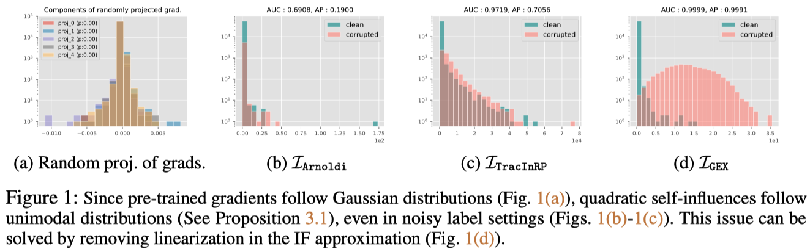

# Geometric Ensemble for sample eXplanation (GEX)

Official code implementation of "GEX: A flexible method for approximating influence via Geometric Ensemble" (NeurIPS 2023)

## How to use this repo?

* Pull docker image for dependency

    ```shell
    docker pull sungyubkim/jax:ntk-0.4.2
    ```

* Run docker image

    ```shell
    docker run -p 8080:8080/tcp -it --rm --gpus all \
    --ipc=host -v $PWD:/root -w /root \
    sungyubkim/jax:ntk-0.4.2
    ```

* To run a single python file, 

    ```shell
    # to pre-train NN
    python3 -m gex.pretrain.main \
        --dataset=mnist \
        --model=vgg \
        --corruption_ratio=0.1
    ```

    ```shell
    # to estimate influence of pre-trained NN
    python3 -m gex.noisy.main \
        --dataset=mnist \
        --model=vgg \
        --corruption_ratio=0.1 \
        --num_ens=8 \
        --ft_lr=0.05 \
        --ft_step=800 \
        --ft_lr_sched=cosine \
        --if_method=la_fge
    ```

* To run multiple python files at once with `./gex/{task}/total.sh`

    ```shell
    bash gex/mnist/total.sh
    ```

* Basically, results files (e.g., log, checkpoints, plots) will be saved in 

    ```shell
    ./gex/{task}/result/{pretrain_hyperparameter_settings}/{posthoc_hyperparameter_settings}
    ```

## Motivation: Identifying and Resolving Distributional Bias in Influence

* **Problem**: As sample-wise gradient ($g_z$) follows stable distribution (e.g., Gaussian, Cauch, and Lévy), bilinear self-influence ($g_z M g_z$) follows unimodal distribution (e.g., $\chi^2$). 



See 

* **Key Idea**: Influence Function can be interpreted as linearized sample-loss deivation (or more simply **covariance**) given parameters are sampled from Laplace Approximation. 

$$
\mathcal{I}(z,z') 
= \mathbb{E}\left[ \Delta \ell^\mathrm{lin}_{\theta^*}(z, \psi) \cdot \Delta \ell^\mathrm{lin}_{\theta^*}(z', \psi)\right]
= \mathrm{Cov}\left[\ell^\mathrm{lin}_{\theta^*}(z,\psi), \ell^\mathrm{lin}_{\theta^*}(z', \psi)\right].
$$

* **Solution**: (1) **Remove linearizations** in sample-loss deviation and (2) Replace Laplace Approximation with **Geometric Ensemble** to mitigate the singularity of Hessian.

$$
\mathcal{I}
\overset{\texttt{Delinearization}}{\underset{\texttt{Section 4.1}}{\longrightarrow}}
\mathcal{I}_\mathrm{LA}
\overset{\texttt{LA to GE}}{\underset{\texttt{Section 4.2}}{\longrightarrow}}
\mathcal{I}_\mathrm{GEX}
$$


## Supporting post-hoc methods

```python
from gex.influence.estimate import compute_influence
# to compute influence kernel (N_tr, N_te) between train-test
influence_kernel = compute_influence(trainer, dataset_tr, dataset_te, dataset_opt , self_influence=False)
# to compute self-influence (N_tr) for train dataset
influence_kernel = compute_influence(trainer, dataset_tr, dataset_te, dataset_opt , self_influence=True)
```

* Random Projection (`--if_method=randproj`)
* TracIn Random Projection (`--if_method=tracinrp`)
* Arnoldi (`--if_method=arnoldi`)
* Laplace approximation with K-FAC (`--if_method=la_kfac`)
* Geometric Ensemble (`--if_method=la_fge`)